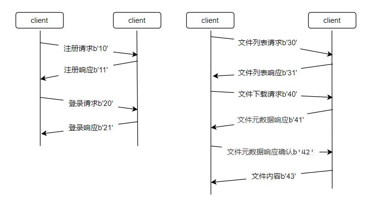

### 数据库设计

数据库使用mysql，连接信息在MysqlHandler.py文件


### 密钥协商

服务端和客户端都分别有自己的一对公钥和私钥，且有对方的公钥。

客户端连接到服务端之后，服务端产生一段随机字节码用于对称加密的会话密钥。

首先服务端用客户端公钥对会话密钥加密，另外用服务端私钥对会话密钥的哈希值进行签名，随后将这两个数据发给客户端。

客户端先用服务端公钥对会话密钥解密，在对会话密钥签名进行验证。

### 数据包报头

| 数据包类型名称    | 数据包类型字节码 | 类型说明           |
| ----------------- | ---------------- | ------------------ |
| DISCONNECT        | 00               | 通知服务器关闭连接 |
| REGISTER_REQUEST  | 10               | 注册请求           |
| REGISTER_RESPONSE | 11               | 注册响应           |
| LOGIN_REQUEST     | 20               | 登录请求           |
| LOGIN_RESPONSE    | 21               | 登录响应           |
| CATALOG_REQUEST   | 30               | 文件列表请求       |
| CATALOG_RESPONSE  | 31               | 文件列表响应       |
| FILE_REQUEST      | 40               | 文件下载请求       |
| FILE_METADATA     | 41               | 文件元数据响应     |
| FILE_METADATA_OK  | 42               | 文件元数据响应确认 |
| FILE_CONTENT      | 43               | 文件内容           |

### 加密数据通信模型

任何功能的会话都是客户端主动发起，客户端根据客户端发送的包头协议类型代码来做出响应的动作。

只针对数据部分进行加密，不对数据包头协议类型代码加密。



### 多线程非阻塞GUI处理

以登录为例，如果客户端登录时，服务器忙就会导致数据传递的延迟，延迟时间较长时，会导致客户端GUI出现未响应。

为了解决这个问题，需要将登录函数做一个多线程来处理，当登录结果返回时，通过emit信号来触发GUI的改变。

```python
class LoginThread(QtCore.QObject):
    finished = QtCore.Signal(bool)

    def __init__(self, client, data):
        super().__init__()
        self.client = client
        self.data = data

    def run(self):
        login_result = self.client.login_request(self.data)
        if login_result:
            self.finished.emit(True)
        else:
            self.finished.emit(False)
            
            
class Login(QtWidgets.QWidget):
    def __init__(self, main):
        self.ui.pushButton.clicked.connect(self.do_login)

    # 触发登录功能
    def do_login(self):
        # 禁用登录按钮，避免重复登录
        self.ui.pushButton.setEnabled(False)
        # 获取数据
        username = self.ui.lineEdit.text()
        password = self.ui.lineEdit_2.text()
        request_data = {"username":username, "password":password}
        request_data = json.dumps(request_data)
        # 启动后台线程执行登录操作
        self.thread_pool = ThreadPoolExecutor()
        self.login_thread = LoginThread(self.main.client, request_data)
        self.login_thread.finished.connect(self.do_login_finished)
        self.thread_pool.submit(self.login_thread.run)

    # 登录多线程返回触发
    def do_login_finished(self, result):
        if result:
            QtWidgets.QMessageBox.information(self, 'information', 'login success')
            self.ui.lineEdit.clear()
            self.ui.lineEdit_2.clear()
            self.main.login_ui.close()
            self.main.index_ui.show()
        else:
            QtWidgets.QMessageBox.warning(self, 'warning', 'user or password uncorrect')
```

### 防止sql注入

只用到`escape_string`来对一些字符进行转义处理达到一定程度上缓解措施。

可以防止万能口令`1' or 1=1#`
