github链接`https://github.com/isBigChen/FileTrans`

# 1.系统设计

文件传输系统采用客户端-服务器架构，服务端监听模式开启后，接收来自客户端的连接，首先建立会话密钥，之后根据所设计的协议码进行注册、登录、文件列表获取、文件下载功能。

## 1.1 用户界面

客户端有三个用户界面，分别是登录、注册、主窗口。登录和注册界面类似。

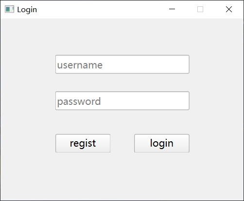  

主窗口中有两个按钮，一个用于获取服务端的文件列表，另一个按钮用于下载文件。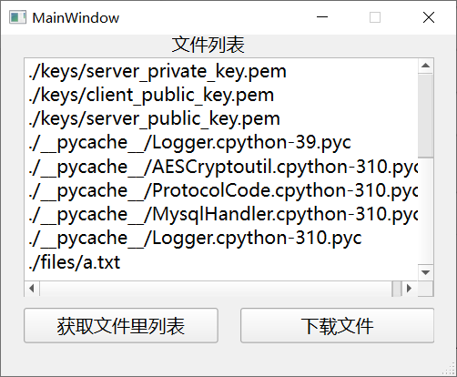

## 1.2 整体流程图

客户端连接服务端后，首先与服务端建立会话密钥，在协商好密钥之后，客户端可以将用户输入的数据进行加密后发送注册或者登录请求；

服务端获取数据后进行解密，并在数据库中进行更新和查询，并将结果进行加密返回给客户端；

客户端接收到请求的响应后进行解密，根据状态码提示用户注册或登录是否成功。

在用户登录成功后跳转到主页面，首先向服务端发送获取文件列表请求，服务端收到请求后将文件列表加密返回给客户端；

客户端解密后显示在图形界面里；

当客户端发送下载文件请求时，将要下载的文件名加密发给服务端，服务端收到消息解密后将文件内容加密后发给客户端；

客户端将收到的文件内容解密并拼接后保存成本地文件。

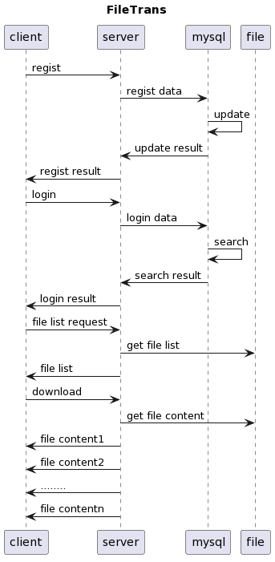

## 1.3 服务端流程图

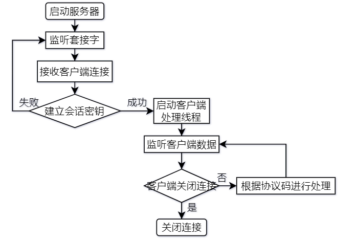

## 1.4 数据包头设计

在建立会话密钥之后，客户端发送的报文格式为两个字节的请求类型拼接加密的数据；

服务端发送的报文格式按照情况分两种类型，一种是需要返回注册或者登录是否成功标志的格式，是由两个字节协议头加一个字节响应码(一个字节的响应码中0表示失败，1表示成功)加加密数据的格式；另一种是不需要返回成功标志直接返回数据的格式，这种格式和客户端发送的报文格式相同。

任何功能的会话都是客户端主动发起，客户端根据客户端发送的包头协议类型代码来做出响应的动作。

只针对数据部分进行加密，不对数据包头协议类型代码加密。

报文格式如下图所示


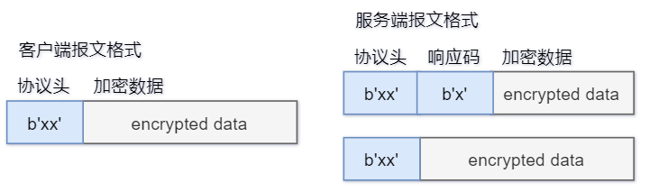

数据包头设计表格如下

| 数据包类型名称    | 数据包类型字节码 | 类型说明           |
| ----------------- | ---------------- | ------------------ |
| DISCONNECT        | 00               | 通知服务器关闭连接 |
| REGISTER_REQUEST  | 10               | 注册请求           |
| REGISTER_RESPONSE | 11               | 注册响应           |
| LOGIN_REQUEST     | 20               | 登录请求           |
| LOGIN_RESPONSE    | 21               | 登录响应           |
| CATALOG_REQUEST   | 30               | 文件列表请求       |
| CATALOG_RESPONSE  | 31               | 文件列表响应       |
| FILE_REQUEST      | 40               | 文件下载请求       |
| FILE_METADATA     | 41               | 文件元数据响应     |
| FILE_METADATA_OK  | 42               | 文件元数据响应确认 |
| FILE_CONTENT      | 43               | 文件内容           |

各数据包头在各功能中的示意图如下

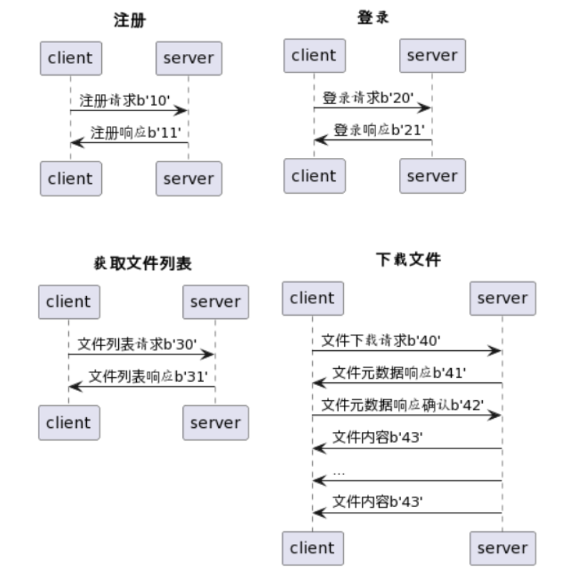

# 2.系统实现

## 2.1 加密通信密钥协商

服务端和客户端都分别有自己的一对公钥和私钥，且有对方的公钥。

客户端连接到服务端之后，服务端产生一段随机字节码用于对称加密的会话密钥。

首先服务端用客户端公钥对会话密钥加密，另外用服务端私钥对会话密钥的哈希值进行签名，随后将这两个数据发给客户端。

客户端先用服务端公钥对会话密钥解密，在对会话密钥签名进行验证。

协商好会话密钥后，客户端和服务端的通信数据都使用密钥通过AES加密进行通信

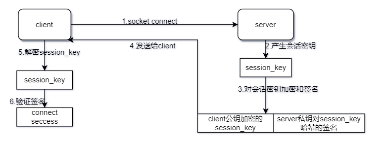

## 2.2 防止中间人攻击分析

服务端产生会话密钥后，用客户端的公钥进行加密，这样只有客户端用自己的私钥可以解密得到会话密钥；

服务端会会话密钥的哈希进行签名，这样客户端可以验证会话密钥的来源是真实的服务端；

因此此系统可以有效地防止中间人攻击。

## 2.3 口令的安全存储

采用口令哈希的方式对用户口令进行存储，考虑到不同用户可能使用相同的密码，会导致存储的口令相同。

设计中不允许用户修改用户名，因此系统中将用户名和口令字符串进行拼接，即将每个用户自己的用户名作为盐值进行哈希运算。

```python
request_data = self.aes_util.aes_decrypt(request_data, self.session_key)
request_data = request_data.decode()
request_data = json.loads(request_data)
username = request_data['username']
password = request_data['password']
password = hashlib.sha1((username + password).encode("utf-8")).hexdigest()
```

存储的用户和口令的数据库表如下图所示

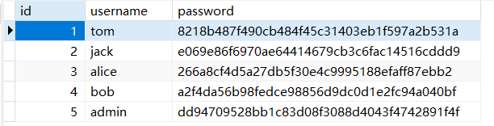

## 2.4 防止sql注入

使用`escape_string`来对一些字符进行转义处理

可以防止万能口令`1' or 1=1#`

```python
username = escape_string(username)
password = escape_string(password)
```

## 2.5 日志审查信息

服务端日志主要包括发起连接的ip信息和下载文件的信息

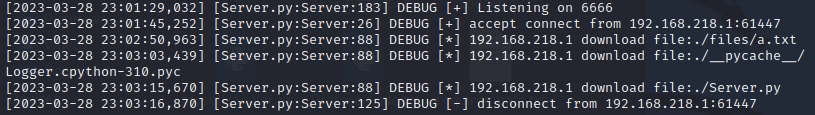

客户端日志主要记录成功下载文件的信息

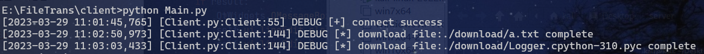

## 2.6 多线程非阻塞GUI

以登录为例，如果客户端登录时，服务器忙就会导致数据传递的延迟，延迟时间较长时，会导致客户端GUI出现未响应。

为了解决这个问题，需要将登录函数做一个多线程来处理，当登录结果返回时，通过emit信号来触发GUI的改变。

```python
class LoginThread(QtCore.QObject):
    finished = QtCore.Signal(bool)

    def __init__(self, client, data):
        super().__init__()
        self.client = client
        self.data = data

    def run(self):
        login_result = self.client.login_request(self.data)
        if login_result:
            self.finished.emit(True)
        else:
            self.finished.emit(False)
            
            
class Login(QtWidgets.QWidget):
    def __init__(self, main):
        self.ui.pushButton.clicked.connect(self.do_login)

    # 触发登录功能
    def do_login(self):
        # 禁用登录按钮，避免重复登录
        self.ui.pushButton.setEnabled(False)
        # 获取数据
        username = self.ui.lineEdit.text()
        password = self.ui.lineEdit_2.text()
        request_data = {"username":username, "password":password}
        request_data = json.dumps(request_data)
        # 启动后台线程执行登录操作
        self.thread_pool = ThreadPoolExecutor()
        self.login_thread = LoginThread(self.main.client, request_data)
        self.login_thread.finished.connect(self.do_login_finished)
        self.thread_pool.submit(self.login_thread.run)

    # 登录多线程返回触发
    def do_login_finished(self, result):
        if result:
            QtWidgets.QMessageBox.information(self, 'information', 'login success')
            self.ui.lineEdit.clear()
            self.ui.lineEdit_2.clear()
            self.main.login_ui.close()
            self.main.index_ui.show()
        else:
            QtWidgets.QMessageBox.warning(self, 'warning', 'user or password uncorrect')
```

# 3.系统部署

## 3.1 数据库部署

数据库使用mysql，采用如下表进行设计，表中存储id主键、用户名和口令，连接信息在MysqlHandler.py文件中

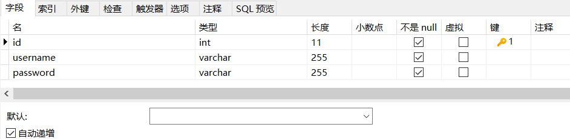

## 3.2 服务端部署

根据情况修改MysqlHandler.py文件中的数据库连接信息

```python
SERVER_IP = "192.168.218.129"
SERVER_PORT = 3306
USER = "root"
PASSWORD = "123456"
DATABASE = "file_trans"
```

情况修改Server.py文件中的监听端口号

```python
SERVER_IP = "0.0.0.0"
SERVER_PORT = 6666
```

安装依赖的第三方包

```shell
pip install -r requirements.txt
```

运行服务端

```shell
python Server.py
```

## 3.3 客户端部署

根据情况修改Main.py文件中的`SERVER_IP`和`SERVER_PORT`

```python
SERVER_IP = "192.168.218.129"
SERVER_PORT = 6666
```

安装依赖的第三方包

```shell
pip install -r requirements.txt
```

运行客户都安

```shell
python Main.py
```

# 4.注意事项

linux和windows环境下对于Crypto第三方包有不兼容现象。

windows环境下修改`Server.py#13`为如下内容

```python
from Crypto.Hash import SHA256
```

linux环境下修改`Server.py#13`为如下内容

```python
from Cryptodome.Hash import SHA256
```

